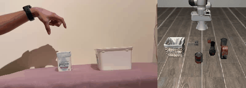
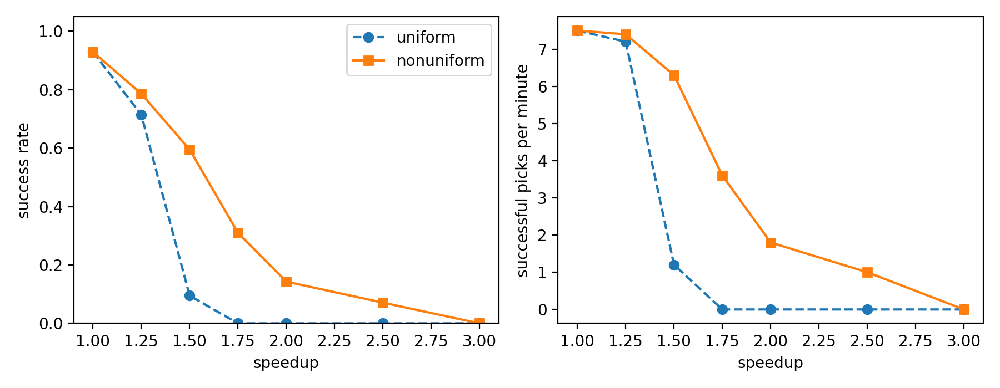
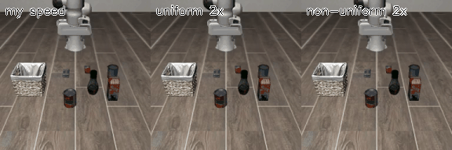
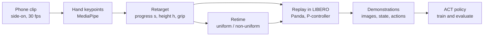

# phone-to-panda

**14 phone clips of my hand, one evening of recording, 101 robot demonstrations.** I filmed myself moving a small box into a tub, turned the video into gripper trajectories, and used them to drive a Panda arm in the LIBERO simulator. Then I measured how far that motion can be sped up before the robot starts failing, and why.



*Left: one of my phone clips. Right: the Panda in LIBERO driven by that clip, kept in step.*

Submission for the Humanoid Robot Learning Research internship challenge. Every result below comes from data I recorded myself.

| | |
| --- | --- |
| Phone clips recorded | 14 |
| Clips that drive the robot to success | 13 |
| Demonstrations produced (8 layouts per clip) | 101 of 112 replays, 90% |
| Speed conditions measured | 42 replays each, on unseen layouts |
| Policies trained only on those demonstrations | ACT 58% and SmolVLA 58% success, 50 episodes each, from camera images and robot state alone |

[Results](#results) · [How it works](#how-it-works) · [Design choices](#design-choices) · [What worked and what did not](#what-worked-and-what-did-not) · [Compute setup](#compute-setup) · [How to run](#how-to-run) · [Repository layout](#repository-layout)

## Results

**1. Phone video to robot motion.** 13 of my 14 clips make the simulated arm complete the task ("pick up the alphabet soup and place it in the basket"). Replayed on 8 different starting layouts each, 101 of 112 replays succeed (90%). One clip (clip-7) fails on every layout and one (clip-2) fails on 3 of 8.

**2. Speeding the motion up.** Each clip was replayed at several speeds in two ways: *uniform* (everything faster) and *non-uniform* (faster everywhere except half a second around the grasp and the release). 42 replays per condition, on layouts the demonstrations never used.

| Speedup | Uniform: success | Uniform: picks/min | Non-uniform: success | Non-uniform: picks/min |
| --- | --- | --- | --- | --- |
| 1x | 93% | 7.5 | 93% | 7.5 |
| 1.25x | 71% | 7.2 | 79% | 7.4 |
| 1.5x | 10% | 1.2 | 60% | 6.3 |
| 1.75x | 0% | 0.0 | 31% | 3.6 |
| 2x | 0% | 0.0 | 14% | 1.8 |
| 2.5x | 0% | 0.0 | 7% | 1.0 |
| 3x | 0% | 0.0 | 0% | 0.0 |

"Picks/min" is successful picks per minute of path time, so a fast motion that fails often scores low.

No speedup beat normal speed on successful picks per minute (7.5). The arm finishes sooner when sped up, but it fails often enough to lose overall.

Non-uniform speedup is better than uniform at every speed where anything works. The clips that survive speedup are my slow ones; my fastest clips fail first. So the limit is the absolute speed the arm can track, not the speedup factor.





*The same clip three ways. At uniform 2x the arm picks the can up, but the gripper opens while the arm is still moving fast and the can is thrown clear of the basket. Non-uniform 2x slows down around the release and drops it in.*

**3. Training policies on the demonstrations.** I trained two policies on my 101 demonstrations and nothing else: ACT from scratch, and SmolVLA fine-tuned from its public base checkpoint. Both complete the task in 29 of 50 evaluation episodes (58%). At test time a policy gets two camera images and the robot's own state. It is never told where the object or the basket is.

| Policy | Training | Actions executed before looking again | Success | Episodes |
| --- | --- | --- | --- | --- |
| ACT, from scratch | 85,000 steps, about 13 hours on a T4 | 20 | **58%** | 50 |
| SmolVLA, fine-tuned | 20,000 steps, 2 hours 36 minutes on an L4 | 10 | **58%** | 50 |
| SmolVLA, fine-tuned (same weights) | as above | 50, the default | 20% | 50 |
| ACT, from scratch | 45,000 steps | 20 | 48% | 50 |

All four rows use 256 x 256 images, the same as training.

**The SmolVLA result depends on how often it looks.** SmolVLA predicts 50 actions at a time, and by default executes all 50 (2.5 seconds) before it looks at the cameras again. Run that way, my fine-tuned model scored 20%. I had evaluated ACT re-planning every 20 actions, so I re-ran the same SmolVLA weights re-planning every 10. That scored 58%. Nothing was retrained between the two rows. I chose 10 after seeing the 20%, so the 58% is a setting picked with knowledge of the first result, on the same 50 episodes. I report both for that reason.

What I take from it: with 101 demonstrations of one task, a pretrained VLA reached the same success rate as ACT in under a quarter of the training steps, but only when it re-planned often. The two 58% figures being identical is a coincidence of 29 successes each. With 50 episodes the standard error is about 7 points, so this does not show one policy is better than the other.

Earlier ACT runs, kept for the record:

| Policy | Evaluation images | Success | Episodes |
| --- | --- | --- | --- |
| ACT, 45,000 training steps, first run at the correct size | 256 x 256, same as training | 55% | 20 |
| ACT, 45,000 training steps | 360 x 360, my mistake | 0% | 20 |
| ACT, 15,000 training steps | 360 x 360, my mistake | 0% | 70 |

In the 20-episode run, successful episodes finished in 106 to 273 steps and the 9 failures all ran to the 400-step limit. So the policy either completes the task at about the speed of my demonstrations or does not complete it at all.

The 0% rows are not a property of the policy. For two days I evaluated at the wrong image size and believed the policy had failed. That story is under "What worked and what did not". Going from 45,000 to 85,000 ACT steps moved the result from 48% to 58%. With 50 episodes each, that gap is about one standard error wide, so I read it as "more training probably helps a little", not as a proven gain.

## How it works



1. **Record.** Phone fixed side-on at table height. Box and tub 20 cm apart. 14 clips of 5 to 10 seconds.
2. **Keypoints.** MediaPipe Hand Landmarker gives wrist, thumb tip and index tip in every frame (`src/extract_keypoints.py`).
3. **Retarget.** Each clip becomes three signals relative to the object, not the camera: progress `s` from pick (0) to place (1), height `h` in metres, and a grip flag (`src/retarget.py`).
4. **Replay.** A proportional controller makes the Panda follow that path in LIBERO, using the object and basket positions from the simulator (`src/replay_libero.py`). Successful replays are saved as demonstrations (`src/build_demos.py`).
5. **Speed up.** The same trajectories are retimed uniformly or non-uniformly and replayed again (`src/retime.py`, `src/speed_sweep.py`).

## Design choices

- **Object-centric retargeting.** Because the path is stored relative to the pick and place points, one phone clip can be replayed on any layout. 14 clips gave 101 demonstrations.
- **Side-on camera, planar motion.** Left-right in the image is progress, up-down is height. Depth is ignored. This needs no camera calibration: the hand travels a known 20 cm between grasp and release, which sets the scale.
- **End-effector space only.** A parallel gripper needs a position and open or closed. I use the midpoint of thumb and index, and ignore the other landmarks.
- **Why a speed experiment.** Humanoid's public technical write-up says naive speedup of a policy hurts grasping and that speeding up the data non-uniformly works better. I wanted to see whether that shows up with my own data. The challenge did not ask for this; it is my reading of what would be useful.

## What worked and what did not

**Hand to gripper needed four fixes.** With the raw retargeted path the arm succeeded 0 times out of 5.

| Problem | Cause | Fix |
| --- | --- | --- |
| Fingers hit the object on the way in | A hand can slide in from the side, a gripper cannot | Force a vertical approach before the grasp |
| Arm trailed about 5 cm behind the path | The simulator's controller is compliant | Proportional gain of 3 |
| Carried object knocked the basket over | The path came in too low | Reach release height by the halfway point |
| Object left behind | A hand pinches faster than the gripper closes | Hold still for 10 steps (0.5 s) at the grasp |

**Grasp detection from finger spacing failed.** Around a rigid 6 cm box my fingers only close from about 10 cm to 7 cm, too small a change to detect reliably. I switched to using the hand's path: the two lowest points, one at each end of the sideways travel.

**The hand's shadow was detected as a hand** for about a second in the first clip. Keeping only the longest continuous track removes it.

**clip-7 fails everywhere.** Its grasp is detected too early (it reports holding the box for 6.6 of 7.7 seconds), so the gripper closes in the wrong place.

**I evaluated the policy at the wrong image size for two days.** The first policy scored 0 of 50. In the videos the arm drifted away from the objects. I checked for a mismatch between training and evaluation, found none, and concluded the policy had not learned. Re-planning more often and a longer step limit changed nothing. Then a policy with three times the training also scored exactly 0, which pointed away from training and back at the evaluation.

The cause: my demonstrations are 256 x 256 images, and LeRobot's LIBERO evaluation config defaults to 360 x 360. My check had missed it because I built the environment class directly, and that class defaults to 256, so the images I compared were not the images the evaluation fed to the policy. With `--env.observation_height=256 --env.observation_width=256` the same checkpoint goes from 0% to about 50%.

What I take from it: compare the tensors at the policy's input, in the real evaluation path, not a reconstruction of what the pipeline should produce. And a result of exactly zero across very different training budgets is a sign of a broken measurement, not a weak model.

**Housekeeping that went wrong.** The results file of the first speed sweep was lost when its Colab session ended. Every outcome had been printed in the log, so `src/reconstruct_sweep.py` rebuilds the file from that log; the step counts are recomputed, which is exact because retiming is deterministic. Rows for 1.25x and 1.75x come from a later run and were written directly.

## Limits

- Depth and wrist rotation are ignored. The gripper always points straight down.
- One task, one object, one simulator.
- Building demonstrations reads object and basket positions from the simulator. A trained policy would not get those; it sees only camera images and its own state.
- The speed results are for open-loop replay with a simple controller, not for the learned policy.
- The policy results are from 50 episodes each on one task, so each figure is uncertain by roughly 7 points either way. I have not evaluated the 15,000-step policy at the correct image size.
- 14 clips from one person on one evening.

## Compute setup

The work is split across two machines, because my laptop cannot run the simulator or train a policy.

| Stage | Where | Why |
| --- | --- | --- |
| Recording, keypoint extraction, clip checks | Windows laptop, CPU only | MediaPipe runs on a CPU. No GPU needed |
| LIBERO replays, demonstrations, speed sweeps, videos | Google Colab, CPU runtime | LIBERO is built on robosuite and MuJoCo with headless EGL rendering, which is a Linux stack. The replays use physics, not a GPU |
| ACT training and evaluation | Google Colab, T4 GPU | My laptop has no CUDA GPU. Training took about 2 hours 20 minutes per 15,000 steps on a T4 |
| SmolVLA fine-tuning and evaluation | Google Colab, L4 GPU | On the T4 one SmolVLA step took 4.2 seconds, which made 20,000 steps a 23-hour job. On an L4 it ran at about 2.1 steps per second and finished in 2 hours 36 minutes |

Colab sessions are not persistent, and that shaped the tooling. Every long job copies its inputs from Google Drive to local disk first, writes results and checkpoints back as it goes, and can be restarted. `src/colab_train_act.py` and `src/colab_continue_training.py` are those job scripts.

**Why ACT first, then SmolVLA.** The challenge suggests a small VLA such as SmolVLA. I trained ACT first because it is about a tenth of the size and trains on a T4, which let me get the full loop (data, training, evaluation) running end to end before spending more GPU hours. Once ACT evaluated correctly I fine-tuned SmolVLA on the same dataset. SmolVLA's base checkpoint expects cameras named `camera1` and `camera2`, so the run maps my two camera streams onto those names. Mixed-precision training (`use_amp`) failed on this model with a bfloat16 error, so it ran in full precision. The commands are in `src/colab_train_smolvla.sh`.

## Repository layout

```
data/keypoints/        hand keypoints for the 14 clips (wrist, thumb tip, index tip per frame)
src/                   pipeline scripts, one per step
results/
  replay_speed_raw.csv one row per replay: clip, layout, method, speedup, success, steps
  replay_speed.csv     the table in this README
  figures/speed.png    the chart in this README
  videos/              replay videos at each speed, and the side-by-side
  policy/              training and evaluation logs; eval_58_excerpts.txt has the result lines behind the 58% and 20% rows
```

## How to run

Laptop (any OS), for steps 2 and 3:

```
pip install -r requirements.txt
# download hand_landmarker.task from the MediaPipe model page into the repo root
python src/extract_keypoints.py --clips data/raw --out data/keypoints
python src/check_clips.py
```

The keypoints for my 14 clips are already in `data/keypoints/`, so everything below runs without the videos.

Linux or Google Colab, for the simulator:

```
pip install "lerobot[libero]"
export MUJOCO_GL=egl
echo N | python -c "import libero.libero"
python src/build_demos.py            # replay every clip, save demonstrations
python src/speed_sweep.py 10 13      # speed comparison on layouts 10 to 12
python src/summarise_speed.py
python src/plot_results.py
python src/make_videos.py clip-13    # replay videos
```

Notes from running these on a fresh copy of the repo:

- One replay takes about 40 seconds on a Colab CPU, so the 112 demonstration replays in `build_demos.py` take a little over an hour.
- `speed_sweep.py` resumes from `results/replay_speed_raw.csv`. The repo ships that file complete, so the command prints `DONE` straight away. To re-run the sweep yourself, move that file aside first. `SPEEDS=1.25,1.75 python src/speed_sweep.py 10 13` adds the two extra speeds in the table.
- MuJoCo prints an EGL error traceback when each script exits. It comes after the results are written and the exit code is 0.

To check the 58% ACT result without retraining, download the trained checkpoint (85,000 steps) from [Google Drive](https://drive.google.com/drive/folders/1PTeBDsUhcThQw31Oksxo9cyUqcHkPts4?usp=sharing) and evaluate it:

```
lerobot-eval --policy.path=<path to the pretrained_model folder inside the download> \
  --policy.n_action_steps=20 \
  --env.type=libero --env.task=libero_object --env.task_ids=[0] \
  --env.observation_height=256 --env.observation_width=256 \
  --env.episode_length=400 --eval.batch_size=1 --eval.n_episodes=50
```

The two image-size flags matter. Without them the evaluation renders 360 x 360 images and the result is 0%.

Policy training used `src/convert_demos.py`, then `lerobot-train --policy.type=act`. The exact commands are in `src/colab_train_act.py` and `src/colab_continue_training.py`, which are the Colab job scripts I ran. The SmolVLA fine-tune and its evaluation are in `src/colab_train_smolvla.sh`.

## Why this could matter for a humanoid robot company

I built this around problems Humanoid describes in its public technical write-up, not around a benchmark.

- **Cheap data.** A phone, a table and one evening produced 101 robot demonstrations. Storing the motion relative to the object is what turns 14 clips into 101, because each clip replays on any layout. The same idea should apply to human video collected at scale.
- **The same interface.** The pipeline works in end-effector space: where the gripper should be and whether it is closed. That is the action space Humanoid's VLA uses, so human hand video maps onto it without a hand-to-joint model.
- **Throughput, measured.** Industrial customers pay for picks per minute, not success rate alone. This repo reports successful picks per minute at each speed and shows where speedup stops paying off.
- **Evidence for retiming the data, not the playback.** Keeping the grasp at normal speed beat uniform speedup at every speed that worked at all. That matches what Humanoid reports for its own policies, here reproduced on 14 clips from a phone.
- **Known failure modes.** Every failure in this project has a cause written next to it, including the two days I lost to my own evaluation error.

## What I would build next

In the order I would do them:

1. **A tracking controller that anticipates the path.** The proportional controller lags at speed. Feed-forward velocity should move the point where speedup breaks, and would show whether the limit is the controller or the physics of the grasp.
2. **Close the gap from 58%.** Look at the episodes that time out, train longer, and try temporal ensembling of the action chunks. For SmolVLA, sweep how often it re-plans on a separate set of episodes, so the setting is not chosen on the test set.
3. **Residual RL on top of the replay.** Keep the retargeted path as the base and let PPO learn small corrections with a time penalty. My earlier work was PPO on the Shadow Hand in MuJoCo, so this is the direction I know best.
4. **Depth and rotation.** Add a second camera, or an egocentric view with a hand-pose model, so the retargeting is no longer planar.
5. **A second embodiment.** Replay the same object-centric trajectories on a different gripper to test how much of the pipeline is robot-specific.
